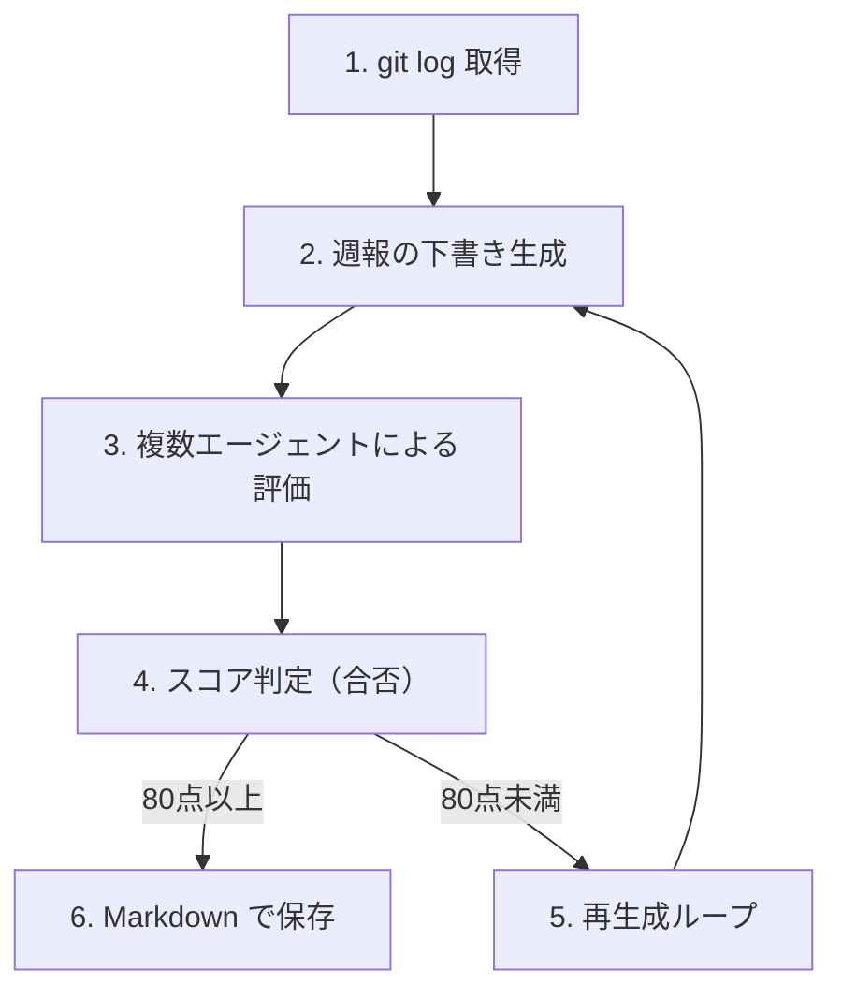
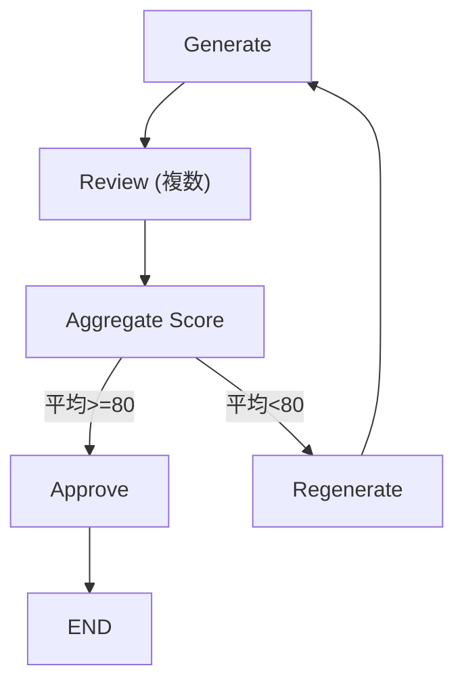
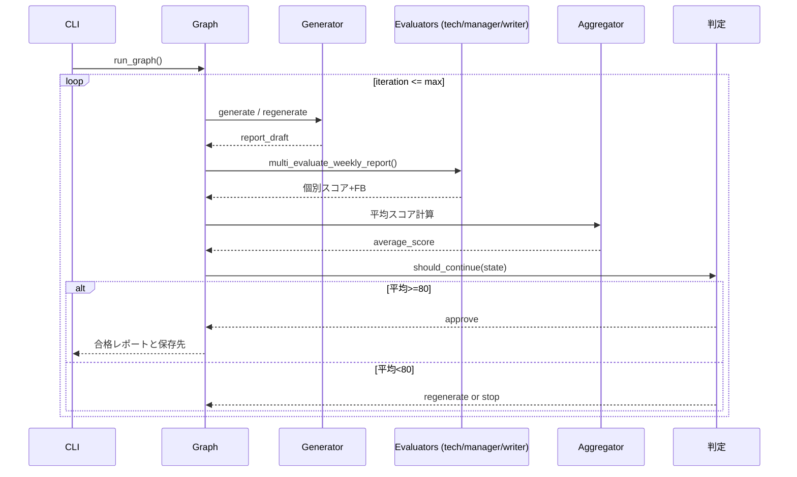

# 【LangGraph実践】週報を自動生成→AI評価→80点まで自動改善するCLIツールの作り方

## はじめに

### なぜ「週報生成」はLLM題材としてちょうどいいのか

生成AIを使ったサンプルとして、よく「ブログ生成」や「要約ツール」が紹介されます。
しかし実務で本当に使われ続ける題材は、もう少し地味なところにあります。

その代表例が **週報**です。

週報には、次のような特徴があります。

* 毎週、ほぼ同じ構造で書く
* 情報源（作業ログ・コミット履歴）が明確
* 完成度に「良し悪し」がはっきり存在する
* 書くのは面倒だが、なくすことはできない

つまり週報は、

> **「生成 → 評価 → 修正」**

というプロセスが必ず発生する文章です。

この「一度作って終わりではない」性質こそが、
LangGraphのような **状態とループを扱えるフレームワーク**と非常に相性が良い理由です。


### 本記事で作るもの（完成イメージ）

本記事では、以下のような **CLIツール**を実装します。

```bash
$ uv run main.py generate
```

この1コマンドで、次の処理が自動的に行われます。

1. `git log -p` から今週分の作業ログを取得
2. ログを元に週報の下書きを生成
3. 複数の「評価エージェント」が週報をレビュー
4. 各評価を数値スコア化し、平均スコアを算出
5. 80点未満の場合はフィードバックを反映して再生成
6. 合格点に達した週報を出力

特徴は、「AIが週報を書く」ことではありません。

> **AIが週報を評価し、改善するプロセスをコードで表現する**

点にあります。

LangGraphを使い、

* State設計
* 条件分岐
* 評価ループ

を明示的に組み立てることで、
「生成AIを業務フローに組み込むとはどういうことか」を体感できる構成になっています。


### この記事で扱わないこと

本記事は **LangGraphの実務設計**にフォーカスしています。
そのため、以下の内容は扱いません。

* LangChain / LangGraph の基本概念の解説
* LLM APIの初期設定や認証の細かい手順
* プロンプトエンジニアリングの一般論
* Webアプリ（Flask / FastAPI）としての実装

これらはすでに良質な資料や記事が多く存在します。

本記事ではそれらを前提知識とし、

> **「じゃあ、実務でどう設計するのか？」**

という部分に集中します。

「LangGraphを触ったことはあるが、
どこで使えばいいのかまだ腹落ちしていない」

そんな方に向けた、**一歩先の実装例**を目指します。


# なぜLangGraphを使うのか

LangGraphは強力なフレームワークですが、
**すべてのLLMアプリに必要なわけではありません。**

この章ではまず、

> 「なぜ今回の週報生成では LangGraph を使うのか」

を、あえて **否定から** 入って整理します。


## LLMで週報を作るだけなら、正直LangGraphはいらない

結論から言うと、

> **週報を一度生成するだけなら、LangGraphは不要です。**

例えば、

* git log をまとめる
* テンプレートに当てはめる
* Markdownを出力する

だけであれば、

* 単一のプロンプト
* もしくは LangChain の Runnable

で十分に実装できます。


### LangGraphを使うと、むしろ複雑になる

LangGraphを導入すると、

* State設計が必要
* ノード分割が必要
* 条件分岐を明示する必要がある

と、**コード量も思考量も増えます。**

「とりあえず週報を作りたい」だけなら、
これは完全にオーバーエンジニアリングです。


### それでもLangGraphを使う理由は何か？

今回の目的は、

> **「週報を作ること」ではありません。**

次の章で扱うように、
本質は **「生成プロセスを制御すること」** にあります。


## 「生成 → 評価 → 修正」をコードで表現したい

実務で生成AIを使うと、必ずこうなります。

* 初回生成はだいたい微妙
* レビューで指摘が入る
* それを反映して書き直す

人間なら自然にやっているこの流れを、
**コードとして表現できるか？**
ここが今回のテーマです。


### if文やwhile文では表現しづらい

単純に書こうとすると、

* if がネストする
* while が止まらない
* 途中状態が追えない

といった問題が発生します。

```python
while True:
    draft = generate()
    score = review(draft)
    if score >= 80:
        break
```

このコードは一見シンプルですが、

* 何回目か分からない
* なぜ失敗したか残らない
* 将来の拡張がしづらい

という欠点を抱えています。


### 「状態」を明示したい

今回やりたいのは、

* 今何回目の生成か
* 直前の評価は何点か
* どんな指摘があったか

を **すべてStateとして持つ**ことです。

LangGraphは、この「状態を中心にした設計」を
自然に書けるフレームワークです。


## LangGraphがハマる3つの条件

LangGraphが真価を発揮するのは、
次の3条件がそろったときです。


### ① 状態を持つ

今回の週報生成では、

* git diff
* 下書き
* レビュー結果
* スコア
* 生成回数

といった情報が、
**生成のたびに更新されていきます。**

これらを

> 「変数」ではなく
> **「State」として扱う**

ことが重要です。


### ② 分岐がある

評価結果によって、

* 合格 → 終了
* 不合格 → 再生成

という明確な分岐があります。

さらに将来的には、

* スコアが低すぎる場合は打ち切り
* iteration上限に達したら警告

といった分岐も追加できます。


### ③ ループがある

今回のコアは、

> **「評価に基づいて、生成をやり直す」**

というループです。

LangGraphは、

* どこからどこへ戻るか
* どの条件で抜けるか

を **グラフとして明示**できます。

これにより、

* 無限ループを防ぎやすい
* 処理の全体像が理解しやすい

というメリットがあります。


### この章のまとめ

* 週報を1回作るだけならLangGraphは不要
* 今回の目的は「生成プロセスの制御」
* 状態・分岐・ループがある処理にLangGraphは強い
* LangGraphは「賢いif文」ではなく「設計ツール」

次章では、
**この考え方を前提にした全体アーキテクチャ**を解説します。


# 全体アーキテクチャ設計

この章では、今回作る「週報生成CLIツール」が
**どのような流れで動き、なぜこの構成になっているのか**を整理します。

先に全体像を把握しておくことで、
後続の章で出てくる State や LangGraph の設計が理解しやすくなります。


## 今回の処理フロー全体像

まずは、処理の流れをシンプルに分解します。

今回の週報生成は、以下の6ステップで構成されています。

1. **git log 取得**
2. **週報の下書き生成**
3. **複数エージェントによる評価**
4. **スコア判定（合否）**
5. **必要に応じた再生成ループ**
6. **合格した週報を Markdown で保存**



重要なのは、
「生成 → 評価 → 終了」では終わらない点です。


### 従来のLLMツールとの違い

一般的な生成AIツールは、次のような構造になりがちです。

```text
入力 → LLM → 出力
```

しかし、実務ではこの出力をそのまま使うことはほとんどありません。

* 内容が薄い
* 視点が偏っている
* 書き直したくなる

そこで人間が介入し、修正します。

今回の設計では、この **「人間がやっていた改善プロセス」**を
そのままコードに落とし込みます。

```text
入力
  ↓
生成
  ↓
評価
  ↓
条件判定
  ↓
再生成（必要なら）
```

LangGraphは、このような**業務フロー型の処理**を表現するのに適しています。


## ディレクトリ構成と責務分離

ここで、今回のディレクトリ構成を確認します。

```text
weekly-report/
├── main.py          # エントリーポイント
├── cli.py           # CLI定義
├── build_graph.py   # LangGraph構築
├── state.py         # State定義
├── git_loader.py    # git log取得
├── generator.py     # 週報生成
├── evaluator.py     # 評価ロジック
├── multi_evaluator.py # 複数評価統合
└── report/          # 生成済み週報(Markdown)の保存先
```

この構成で意識しているのは、
**「1ファイル = 1責務」**です。


### 各ファイルの役割

* **main.py**
  → アプリの起動点。ロジックは持たない

* **cli.py**
  → ユーザーとの接点。UXのみを担当

* **state.py**
  → LangGraphで扱う状態を定義する心臓部

* **git_loader.py**
  → 外部データ取得（git）

* **generator.py**
  → 文章生成に集中

* **evaluator.py / multi_evaluator.py**
  → 評価とスコア算出のみを担当

* **build_graph.py**
  → これらを“仕事の流れ”として接続し、最終的な週報を `report/weekly-report-YYYY_MM_DD_hh-mm.md` に保存する

* **report/**
  → CLI実行ごとに生成される週報Markdownを時刻付きで貯める出力フォルダ（Git管理から除外）


### なぜ責務分離が重要なのか

LangGraphを使う場合、
処理の流れは **State と Graph** が担います。

各ノードの中身が肥大化すると、

* 何をしているGraphなのか分からない
* 修正時に壊れやすい
* 再利用できない

という問題が起きます。

今回の構成では、

> **各ノードは単機能
> 全体の意味はGraphが持つ**

という設計を徹底しています。


## 環境構築

最後に、開発環境の準備です。

```bash
~/Desktop $ mkdir weekly-report
~/Desktop $ cd weekly-report
~/Desktop/weekly-report $ uv init
~/Desktop/weekly-report $ uv venv
~/Desktop/weekly-report $ touch cli.py  build_graph.py state.py git_loader.py generator.py evaluator.py multi_evaluator.py
~/Desktop/weekly-report $ source .venv/bin/activate
(weekly-report) ~/Desktop/weekly-report $ uv add typer langchain langgraph openai langchain_openai python-dotenv
~/Desktop/weekly-report $ code .
```

依存関係や詳細設定は、
後続の章で必要になったタイミングで追加していきます。


### .env の準備

LLM API キーなどの秘密情報は `.env` で管理します。`generator.py` では `OPENAI_KEY` を参照しているため、以下のように設定してください。

```env
OPENAI_KEY="sk-..."  # 実際のAPIキーを設定
```

* `.env` は `.gitignore` に追加してリポジトリに含めない
* プロジェクトごと・環境ごとに値を切り替える（例: `.env.production`）
* CI/CDでは環境変数として直接注入してもよい

`python-dotenv` を使ってアプリ起動時に自動ロードすると、ローカルでもCIでも同じ記述で動かせます。キーを平文で共有しないためにも `.env` 運用を徹底しましょう。


次章では、
この構成の入口となる **CLI UX設計**に入ります。


# CLI UX設計（実務で毎週使える設計）

どれだけ内部設計が美しくても、
**毎週使われないツールは失敗**です。

この章では、
LangGraphを使った週報生成ツールを
**「実務で自然に使えるCLI」にするためのUX設計**を解説します。


## CLI設計で最初に決めた3つの原則

CLI設計に入る前に、次の3つを明確に決めました。


### 原則①：考えなくても打てる

毎週金曜日に、

* ドキュメントを開く
* オプションを思い出す
* 使い方を調べる

これは続きません。

```bash
uv run main.py generate
```

**まずはこれだけで動く**
という設計を最優先にしました。


### 原則②：git運用を邪魔しない

このツールの入力は、

* すでに存在する `git log -p`
* 開発者が毎日触っている履歴

です。

* 特別なフォーマットを要求しない
* コミットメッセージの書き方を縛らない

という前提で設計しています。


### 原則③：失敗しても怖くない

生成AIツールは、

* 何をしているか分からない
* 失敗した理由が見えない

と、使われなくなります。

そのためCLIでは、

* 今どの段階か
* なぜ再生成しているか

を **常に表示する** 方針にしました。


## cli.py　実装コード
このCLI実装で重要なのは、
「Typerを使うこと」ではありません。

- CLIは入口であること
- ロジックを持たないこと
- LangGraphにすべてを委譲すること

この3点を満たしていれば、
フレームワークは何でも構いません。

```python:cli.py
# cli.py
"""週報ジェネレーター用の CLI エントリーポイント。"""

import typer

app = typer.Typer(
    name="weekly-report",
    help="git log から週報を自動生成する CLI ツール",
)


@app.command()
def generate(
    since: str | None = typer.Option(
        None,
        "--since",
        "-s",
        help="git log --since に渡す日付/ショートカット（例: 'last monday'）",
    ),
    max_iteration: int = typer.Option(
        3,
        "--max-iteration",
        "-m",
        help="再生成の最大回数（超えると強制終了）",
    ),
    repos: list[str] = typer.Option(
        [],
        "--repo",
        "-r",
        help="git log を取得するリポジトリパス（複数指定可）",
    )
):
    # 週報生成フローを開始
    """指定リポジトリから週報を生成する"""
    typer.echo("週報生成を開始します")
    from build_graph import run_graph
    _, report_path = run_graph(
        since=since,
        max_iteration=max_iteration,
        repos=repos,
    )

    typer.echo(f"Weekly report saved to {report_path}")
    typer.echo("Weekly report generation finished.")


@app.command()
def evaluate(
    report_path: str = typer.Argument(
        ...,
        help="評価対象の週報 Markdown ファイルパス",
    )
):
    # 既存の週報に対して評価のみ実行
    """既存の週報ファイルのみを評価する"""
    typer.echo(f"Evaluating report: {report_path}")
    from evaluator import evaluate_report_file

    result = evaluate_report_file(report_path)

    typer.echo("- Evaluation Result -")
    typer.echo(f"Score   : {result['score']}")
    typer.echo(f"Feedback: {result['feedback']}")


def run():
    # `python -m` から呼び出されるエントリーポイント
    """`python -m` で呼び出される Typer エントリーポイント。"""
    app()

```

## コマンド設計

コマンドはあえて **最小構成** にしています。

```bash
uv run main.py generate
uv run main.py generate --since last-monday
uv run main.py generate --repo ~/work/service-a --repo ~/work/service-b
uv run main.py evaluate report/weekly-report-2026_01_18_09-51.md
```


### 週報の基本的な作成方法

もっとも基本となるコマンドです。

```bash
uv run main.py generate
```

このコマンドは内部で、

* 今週分の `git log -p` を取得
* 初回生成 → 評価 → 再生成（必要なら）
* 合格した週報を出力

までを **一気に実行**します。

「生成途中の細かい制御」は
CLIではなく **StateとGraphに任せる**設計です。


### `--since` オプション

```bash
uv run main.py generate --since last-monday
```

* 先週分をまとめたい
* 途中からやり直したい

といったケースを想定しています。

ここで重要なのは、

> **「期間指定」以外の責務を持たせないこと**

です。

生成品質に関わる設定は、
**CLIではなくコード側で管理**します。


### 複数リポジトリ指定（`--repo` / `-r`）

```bash
uv run main.py generate \
  --repo ~/work/service-a \
  --repo ~/work/service-b
```

サービスが複数リポジトリに分かれている現場では、
追いたいリポジトリを `--repo` で好きなだけ列挙します。
未指定の場合は現在の作業ディレクトリを 1 つ目のリポジトリとして扱います。

`git_loader.py` では各リポジトリに `git -C <path> log -p` でアクセスし、
`### Repository: service-a` のような見出しを付けて 1 本のテキストに結合します。
生成・評価ノードから見ると **「複数リポジトリをまとめた1つのgit diff」** に見えるため、
LangGraphの構造を変えずに入力だけを拡張できます。


### 週報を評価する

```bash
uv run main.py evaluate report/weekly-report-2026_01_18_09-51.md
```

このコマンドは保存済みの Markdown を読み込み、
合否判定だけを行いたいときに使います（`--repo` や `--since` は指定できません）。
生成と評価を分離することで、

* LLMに再生成させずに、人間が修正したファイルを再評価できる
* 過去の週報を振り返り、品質をスコアで揃えられる

といった使い方が可能になります。


## LangGraphを“感じさせる”ログ設計

CLIを実行すると、LangGraphの状態遷移がそのままログに流れます。

```text
[1/3] Generate report (initial)
[Review:tech] Score: 72
[Review:manager] Score: 70
[Review:writer] Score: 74
[Review] Score: 72
→ REJECT（80点未満。残り 2 回の再生成を実行）

[2/3] Regenerate report with feedback
...
[Review] Score: 81
→ ACCEPT（2回目でスコア 81 点に到達）
```

これだけで「いま何回目の生成か」「次にどんなアクションが走るのか」が把握できます。
看板のように状態が見えることで、LangGraphの効果がそのまま利用者にも伝わります。


## 失敗しにくいCLIにするための工夫

### 進捗が明示される

ログには常に `[現在回/最大回]` が出るため、ループが暴走しているのか、そろそろ終わるのかが即座に分かります。
「なぜ1回で終わったのか」「なぜ再生成するのか」も `→ ACCEPT / → REJECT` の行で説明されるので、待っている側も安心です。

### 途中結果も必ず保存される

生成に成功したタイミングで `report/weekly-report-YYYY_MM_DD_hh-mm.md` が作成されます。
最後の案だけでなく「どの案が合格したのか」もファイル名とログから追えるので、後からレビューしたいときも混乱しません。

### エラーは人間が即判断できる

`git log` が取れない／レポートファイルが見つからないなど、人間が対処すべきエラーは CLI がそのまま出します。
AIが沈黙して終わるのではなく、「ここで止まったので次にやるべきこと」が常に可視化されます。

など、**人間が直せるエラー**は
必ず明確なメッセージで止めます。


### この章のまとめ

* CLIは「毎週使えるか」がすべて
* オプションは最小限に抑える
* LangGraphの価値はログ体験で伝える
* 失敗しても安心して使える設計が重要

次章では、
**このCLIを支える State 設計の全体像**を解説します。


# State設計がすべてを決める

LangGraphを使うかどうか以前に、
**State設計が失敗していれば、良いグラフは書けません。**

この章では、

> 「なぜState設計が最重要なのか」
> 「今回の週報生成では、どんなStateを持つのか」

を実務目線で解説します。


## なぜState設計が一番重要なのか

### LangGraphは「関数をつなぐツール」ではない

よくある誤解として、

> LangGraph = ノード（関数）をつなぐライブラリ

という捉え方があります。

しかし実際には、

> **LangGraphは「Stateをどう変化させるか」を設計するフレームワーク**

です。

ノードはあくまで、
**Stateを書き換えるための手段**に過ぎません。


### Stateが曖昧だと、グラフは破綻する

State設計が甘いと、次のような問題が起きます。

* どの情報が最新か分からない
* ノード間の依存関係が見えない
* デバッグが地獄になる

特に評価ループがある場合、

> 「前回の評価結果」
> 「今回の生成が何回目か」

が追えなくなると、
**ループ制御が一気に不安定**になります。


### State = 業務フローの写し鏡

良いState設計は、

* 人間が週報を書き直すときに
* 頭の中で考えていること

を、そのままデータ構造に落としたものです。

つまり、

> **State設計が、そのまま業務理解の深さを表す**

と言っても過言ではありません。


## state.py　実装コード　

ここでは、本記事で使う
**WeeklyReportState の全体像**を示します。

```python:state.py
# state.py
"""LangGraph で扱う状態を TypedDict で明示する。"""

# LangGraph 全体で共有する状態構造を TypedDict で明示する

from typing import TypedDict


class ReviewResult(TypedDict):
    """単一の評価者が出力するスコアとフィードバック。"""

    # 単一レビューアーが出力するメタ情報
    reviewer: str  # reviewer role (e.g. tech / manager / writer)
    score: int  # 0〜100
    feedback: str  # 改善コメント


class GitDiffEntry(TypedDict):
    """1つのリポジトリから取得した `git log -p` の内容。"""

    # リポジトリパスとその差分テキストの組
    repo_path: str
    diff: str


class WeeklyReportState(TypedDict):
    """週報生成フロー全体で共有する状態。"""

    # 入力
    git_diffs: list[GitDiffEntry]  # リポジトリごとの差分（生データ）
    git_diff_text: str  # LLMに渡す連結済みテキスト（見出し付き）

    # 生成物
    report_draft: str  # 現在の週報ドラフト

    # 評価結果
    reviews: list[ReviewResult]  # 各評価者の評価
    average_score: float  # 平均スコア

    # 制御用
    iteration: int  # 現在の生成回数
    max_iteration: int  # 最大生成回数

    # 補助情報（任意）
    selected_repos: list[str]  # CLIで指定されたリポジトリ一覧
    since: str | None  # git log の基準日
    is_approved: bool  # 承認済みかどうか

```


### WeeklyReportState が持つフィールド

```text
WeeklyReportState
├─ git_diffs
├─ git_diff_text
├─ report_draft
├─ reviews
├─ average_score
├─ iteration
├─ max_iteration
├─ selected_repos
└─ since
```

それぞれの役割を見ていきます。


### `git_diffs` / `git_diff_text`

* `git_diffs`
  * 型：list
  * 内容：リポジトリごとの `git log -p`
* `git_diff_text`
  * 型：string
  * 内容：`git_diffs` を `### Repository: ...` 見出し付きで結合したテキスト

`git_diffs` には「どのリポジトリから拾った差分か」という情報を残し、
LLMには `git_diff_text` という **連結済みテキスト** だけを渡します。
こうすることで、

* LangGraphの他ノードからはシンプルな文字列として扱える
* 必要になったときだけリポジトリ単位の差分を参照できる

という拡張性を確保できます。


### `report_draft`

* 型：string

* 内容：現在の週報案

* 初回生成

* 再生成

どちらでも **必ず上書き**されます。

「最新版の週報はどれか？」
を考えなくて済む設計です。


### `reviews`

* 型：list
* 内容：各評価エージェントの結果

例：

```json
[
  { "reviewer": "manager", "score": 78, "comment": "成果が抽象的" },
  { "reviewer": "self", "score": 82, "comment": "全体は良いが具体例不足" }
]
```

ここに「履歴」として残すことで、

* なぜこの改善が入ったのか
* どの観点が弱かったのか

を後から確認できます。


### `average_score`

* 型：number
* 内容：reviews から算出した平均点

この値が、

* ACCEPT
* REJECT

を分ける **制御信号**になります。


### `iteration / max_iteration`

* `iteration`：現在の生成回数
* `max_iteration`：許容する最大回数

これにより、

* 無限ループを防ぐ
* 品質改善が頭打ちになったら止める

という判断が可能になります。


### `selected_repos` / `since` / `is_approved`

* `selected_repos`：CLIから渡ってきたリポジトリ一覧を保持し、`git_loader.py` が参照する
* `since`：`git log --since` にそのまま渡す元情報
* `is_approved`：合格済みかどうかのフラグ（ログ出力や将来の拡張で利用）

CLIの入力（`--repo`, `--since`）を State に閉じ込めることで、
グラフのどのノードからでも同じ情報を参照できます。


## Stateがあるから「評価ループ」が書ける

### Stateなしで書くとどうなるか

もしStateを意識せずに書くと、

* ローカル変数が増える
* 途中経過が追えない
* 条件分岐が散らばる

という状態になります。

結果として、

> 「なぜ止まったのか分からないコード」

になります。


### Stateがあると、ループが“見える”

今回の評価ループは、
Stateで表すと非常にシンプルです。

```text
iteration += 1
if average_score >= 80:
    END
elif iteration >= max_iteration:
    STOP
else:
    再生成
```

重要なのは、

* 判定材料がすべてStateにある
* ノードはStateを書き換えるだけ

という点です。


### LangGraphは「状態遷移図」をコードにする

LangGraphの本質は、

> **状態遷移を、実行可能なコードとして書けること**

です。

Stateが明確に定義されていれば、

* 分岐条件も
* ループ条件も
* 拡張ポイントも

自然に見えてきます。


### この章のまとめ

* LangGraphの設計はState設計から始まる
* Stateは業務フローそのもの
* WeeklyReportStateは「週報作成の思考」を写した構造
* 良いStateが、安定した評価ループを生む

次章では、
**このStateをどう使って「生成エージェント」を実装するか**
を詳しく見ていきます。


# 生成エージェントの実装

ここから、いよいよ **週報を生成する中核エージェント**の話に入ります。

重要なのは、

> **「うまいプロンプトを書くこと」ではありません。**

* どんな情報を渡すか
* どのタイミングで指示を変えるか
* フィードバックをどう再利用するか

という **設計の問題**です。

## git log -p をどうLLMに渡すか

### 全部渡せばいい、は間違い

`git log -p` には、

* コード差分
* ファイルパス
* 行番号
* 無関係な変更

が大量に含まれます。

これをそのまま渡すと、

* トークンを無駄に使う
* 重要な変更が埋もれる
* 出力が冗長になる

という問題が起きます。


### 今回の方針：**「加工せず、役割を与える」**

本記事では、

> **git log を人間向けに整形しない**

という方針を取ります。

理由は2つあります。

1. 前処理が増えると設計が複雑になる
2. LLMの「読む力」を信頼した方が汎用性が高い

その代わり、プロンプトで **役割** を明確に与えます。


### 生成エージェントへの指示例（概念）

```text
以下は1週間分の git log -p です。
この中から、人に伝える価値のある作業内容を抽出してください。

- 細かいコード変更はまとめてよい
- 成果・進捗・課題が分かる形に整理する
```

重要なのは、

> **「どう読むか」を指示すること**

です。


### 複数リポジトリは見出しで区切る

`--repo` で複数指定された場合でも、
LLMには **「読みやすい1つのテキスト」** を渡したいところです。
そこで `git_loader.py` ではリポジトリごとに `git log -p` を取得し、
見出しを付けて連結します。

```python:git_loader.py
# git_loader.py
"""CLIで指定されたすべてのリポジトリから git diff を取得するノード。"""

from pathlib import Path
import subprocess
import typer
from state import WeeklyReportState

LOG_PREFIX = "[load_git]"


def load_git_diff(state: WeeklyReportState) -> WeeklyReportState:
    """Stateにリポジトリ別の diff と連結テキストを格納する。"""
    # CLIでリポジトリが指定されていなければカレントディレクトリを使う
    repo_paths = state["selected_repos"] or [str(Path.cwd())]
    typer.echo(
        f"{LOG_PREFIX} fetching diffs from {len(repo_paths)} repo(s)...")

    diffs = []
    for repo in repo_paths:
        # 各リポジトリで git log -p を実行して差分を取得
        repo_path = Path(repo).expanduser().resolve()
        typer.echo(f"{LOG_PREFIX} running git log -p in {repo_path}")
        cmd = [
            "git",
            "-C",
            str(repo_path),
            "log",
            "-p",
        ]
        if state["since"]:
            cmd.extend(["--since", state["since"]])

        result = subprocess.run(
            cmd,
            capture_output=True,
            text=True,
            check=True
        )
        diffs.append(
            {
                "repo_path": str(repo_path),
                "diff": result.stdout.strip()
            }
        )
    stitched = "\n\n".join(
        f"### Repository: {Path(entry['repo_path']).name}\n{entry['diff']}"
        for entry in diffs
        if entry['diff']
    )

    # LangGraph状態へ diff の生データと LLM向けテキストの両方を保存
    state["git_diffs"] = diffs
    state["git_diff_text"] = stitched.strip()
    typer.echo(
        f"{LOG_PREFIX} collected {len([d for d in diffs if d['diff']])} repo diffs")
    return state

```

この段階では整形せず「どのリポジトリのログかだけ分かる」ようにするのがポイントです。
生成エージェントは `git_diff_text` を読むだけで複数リポジトリの変更点を把握できますし、
将来「特定のリポジトリの diff だけを使いたい」となった際も
`git_diffs` のリストから選び直せます。


## 初回生成と再生成でプロンプトを変える理由

### 同じ指示を出し続けると、改善しない

初回生成と再生成で
**同じプロンプトを使ってはいけません。**

なぜなら、

* LLMは「もう一度書いて」と言われても
* 同じ方向性で書き直す

傾向があるからです。


### 初回生成の役割

初回生成では、

* 全体像をつかむ
* 情報を漏らさず拾う
* 多少粗くてもよい

というスタンスで指示します。

```text
まずは週報の下書きを作成してください。
完成度よりも、情報の網羅性を重視してください。
```


### 再生成の役割

再生成では役割が変わります。

* すでに下書きはある
* 問題点も分かっている

そのため、指示も **改善特化** に切り替えます。

```text
以下の週報案を改善してください。
指摘された点を必ず反映し、
それ以外の部分は大きく変えないでください。
```

この切り替えが、
**「ちゃんと直している感」**を生みます。


## フィードバックを“指示”に変換する設計

### コメントをそのまま渡さない

評価エージェントのコメントは、そのまま渡すと危険です。

例：

> 「成果が抽象的」

これだけ渡すと、

* どこを？
* どの程度？
* どう直す？

が曖昧になります。


### フィードバック → 行動指示へ変換

一度、**指示用の文章**に変換します。

```text
- 成果について、具体的な作業内容や変更点を1〜2文追加する
- 可能であれば数値や完了条件を明記する
```

ここでは、

* 何を
* どの範囲で
* どう直すか

を明示します。


### LangGraphでの役割分担

* 評価エージェント：問題点を見つける
* 変換ロジック：指示に整形する
* 生成エージェント：指示に従って直す

> **「評価」と「修正」を同じエージェントにやらせない**

これが、安定した改善ループを作るコツです。


### generator.py　実装コード
```python:generator.py
"""週報の下書きをLLMで生成・再生成するノード。"""

from langchain_openai import ChatOpenAI
from langchain_core.messages import HumanMessage, SystemMessage
from state import WeeklyReportState
from dotenv import load_dotenv
import os
import typer

load_dotenv()

llm = ChatOpenAI(
    model="gpt-5",
    api_key=os.getenv("OPENAI_KEY")
)


def _build_prompt(state: WeeklyReportState) -> list:
    """iterationごとに適切なプロンプトを組み立てる。"""
    # iteration 0 は初回生成、以降は再生成として扱う
    if state["iteration"] == 0:
        system_prompt = """
あなたは優秀なソフトウェアエンジニアです。
以下の git の変更履歴をもとに、社内向けの週報を作成してください。

・技術的に正確であること
・読み手（上司・チーム）が理解しやすいこと
・簡潔だが情報不足にならないこと
"""
        human_prompt = f"""
【git diff / log】
{state["git_diff_text"]}

上記をもとに、以下の構成で週報を書いてください。

- 今週やったこと
- 技術的なポイント
- 課題・懸念点
"""
    else:
        system_prompt = """
あなたはレビュー指摘を的確に反映できるシニアエンジニアです。
前回の週報を改善してください。
"""
        human_prompt = f"""
【前回の週報】
{state["report_draft"]}

【レビュー指摘】
{state["reviews"]}

上記の指摘をすべて反映し、
より完成度の高い週報に書き直してください。
"""
    return [
        SystemMessage(content=system_prompt.strip()),
        HumanMessage(content=human_prompt.strip())
    ]


def _invoke_llm(state: WeeklyReportState) -> WeeklyReportState:
    """LLMを呼び出し draft と iteration を更新する共通処理。"""
    # プロンプトを組み立てて LLM を呼び出す
    messages = _build_prompt(state)
    response = llm.invoke(messages)
    state["report_draft"] = response.content
    # 生成回数をインクリメントしてループ制御に使う
    state["iteration"] += 1
    return state


def generate_weekly_report(state: WeeklyReportState) -> WeeklyReportState:
    """初回の下書きを生成する LangGraph ノード。"""
    if state["iteration"] != 0:
        # 予期せぬ呼び出しでも整合性を保つため警告的に扱う
        state["iteration"] = 0
    next_iter = state["iteration"] + 1
    typer.echo(
        f"[{next_iter}/{state['max_iteration']}] Generate report (initial)")
    return _invoke_llm(state)


def regenerate_weekly_report(state: WeeklyReportState) -> WeeklyReportState:
    """再生成ノード。レビュー指摘を踏まえて書き直す。"""
    if state["iteration"] == 0:
        # 再生成なのに初回扱いにならないよう最低1回目として扱う
        state["iteration"] = 1
    next_iter = state["iteration"] + 1
    typer.echo(
        f"[{next_iter}/{state['max_iteration']}] Regenerate report with feedback")
    return _invoke_llm(state)

```

### この章のまとめ

* git log は加工せず、読む役割を与える
* 初回生成と再生成は目的が違う
* フィードバックはそのまま使わず、指示に変換する
* 生成エージェントは「職人」ではなく「作業者」

次章では、
**この生成結果をどう評価し、数値スコアに落とすか**
を解説します。


# 評価エージェントを数値スコア化する

生成エージェントがどれだけ優秀でも、
**評価が曖昧だとシステムは賢くなりません。**

この章では、
評価エージェントを「コメント係」ではなく
**フロー制御を担う存在**として設計する方法を解説します。


## evaluator.py　実装コード
```python:evaluator.py
# evaluator.py
"""生成された週報を採点する LLM 評価ノード。"""

from langchain_openai import ChatOpenAI
from langchain_core.messages import HumanMessage, SystemMessage
import re
from dotenv import load_dotenv
import os
from state import WeeklyReportState

load_dotenv()

llm = ChatOpenAI(
    model="gpt-5",
    api_key=os.getenv("OPENAI_KEY")
)


def _build_prompt(state: WeeklyReportState) -> list:
    """数値スコアとフィードバックを必ず返す評価プロンプトを組み立てる。"""
    # 評価観点と出力フォーマットを厳密に指定
    system_prompt = """
あなたは厳密で公平なレビュー担当者です。
以下の週報をレビューし、必ず数値評価を行ってください。

評価観点：
1. 技術的な正確さ
2. 内容のわかりやすさ
3. 情報量の適切さ
4. 業務週報としての完成度

各観点を総合して、0〜100点でスコアをつけてください。
"""
    human_prompt = f"""
【週報本文】
{state["report_draft"]}

【出力形式（必ず守る）】
Score: <0-100の整数>
Feedback:
- 指摘1
- 指摘2
- 指摘3
"""
    return [
        SystemMessage(content=system_prompt.strip()),
        HumanMessage(content=human_prompt.strip())
    ]


def _parse_score(text: str) -> int:
    """LLM出力からスコアを抽出して0〜100に丸める。"""
    # LLM出力からスコアを抽出し、0〜100にクリップ
    match = re.search(f"Score:\s*(\d+)", text)
    if not match:
        raise ValueError("Score が見つかりません")
    score = int(match.group(1))
    return max(0, min(100, score))


def evaluate_weekly_report(state: WeeklyReportState) -> WeeklyReportState:
    """評価チェーンを実行し、Stateにスコアとレビューを追加する。"""
    # 評価を実行し、Stateへスコアとフィードバックを保存
    messages = _build_prompt(state)
    response = llm.invoke(messages)
    content = response.content
    score = _parse_score(content)

    state["reviews"].append(content)
    state["average_score"] = score
    return state


def evaluate_report_file(report_path: str) -> dict:
    """既存の週報ファイルを採点し、スコアとフィードバックを返す。"""
    # 既存の週報ファイルを評価し、スコアとフィードバックを返す
    with open(report_path, "r", encoding="utf-8") as f:
        report_content = f.read()

    state = WeeklyReportState(
        report_draft=report_content,
        reviews=[],
        average_score=0,
    )

    evaluated_state = evaluate_weekly_report(state)

    return {
        "score": evaluated_state["average_score"],
        "feedback": evaluated_state["reviews"][-1],
    }


```

## なぜ文章評価だけではダメなのか

### 人間向けレビューは、システムには使えない

LLMに文章レビューを依頼すると、
多くの場合こうした出力が返ってきます。

> ・全体的に分かりやすい
> ・成果がやや抽象的
> ・もう少し具体例があると良い

人が読む分には十分ですが、
**プログラムとして扱うには致命的な欠点**があります。


### 問題①：判断基準がない

* これは合格？
* どの程度まずい？
* 今回は再生成すべき？

コメントだけでは、
**YES / NO の判断ができません。**


### 問題②：ループ制御ができない

LangGraphでは、

```
生成 → 評価 → 再生成
```

を回します。

しかし、

* いつ止めるか
* 何回まで許すか

を決められないと、
**無限ループ**に陥ります。


### 問題③：複数評価を統合できない

評価者を増やした瞬間に、

* 意見が割れる
* どれを信じるか分からない

という状態になります。

**数値がないと、統合ができません。**


## 0〜100点スコア設計

### なぜ5段階やA/B/Cではないのか

段階評価は一見シンプルですが、

* 改善幅が見えない
* 平均を取りづらい
* 閾値を決めにくい

という問題があります。


### 100点満点のメリット

* 人間の感覚と近い
* 平均値を取りやすい
* 閾値判定が明確

特に **評価ループ前提** では、
100点満点が扱いやすくなります。


### 評価基準を必ず明文化する

スコアのブレを防ぐため、
評価エージェントには基準を与えます。

```text
以下の観点で0〜100点で評価してください。

- 内容の具体性（0〜30）
- 背景説明の分かりやすさ（0〜30）
- 成果の伝わりやすさ（0〜30）
- 構成・読みやすさ（0〜10）
```

ここで重要なのは、

> **評価基準も設計の一部である**

という意識です。


### 出力は必ず構造化する

評価結果は、
**必ず機械可読な形式**で返します。

```json
{
  "score": 78,
  "comment": "成果が抽象的で、具体例が少ない"
}
```

* `score` → 制御用
* `comment` → 改善用

役割を分けることで、
後続処理がシンプルになります。


## 「80点未満はREJECT」という明確なルール

### 判断をAIに委ねない

このツールでは、

> **80点未満は即REJECT**

というルールを採用します。

理由は単純で、

* 迷わせない
* ブレさせない
* 実装を簡単にする

ためです。


### なぜ80点なのか

経験上、

* 60点台：何となく書いてある
* 70点台：方向性は合っている
* **80点台：実務で使える**
* 90点以上：よくできている

という感覚に近いためです。

この数値自体は調整可能ですが、
**「線を引く」ことが重要**です。


### LangGraphでの分岐イメージ

概念的には以下のようになります。

```
if average_score >= 80:
    END
else:
    再生成
```

この単純さが、
**安定した自律ループ**を生みます。


## スコアがあることで再生成が制御できる

### スコアは「品質」ではなく「信号」

ここで重要な考え方があります。

> **スコアは評価ではなく、制御信号である**

という点です。

* 良し悪しを語るため
* AIを反省させるため

ではありません。


### スコア × iteration で判断する

Stateには、

* `iteration`
* `max_iteration`
* `average_score`

があります。

これにより、

* 改善しているか
* 頭打ちになっていないか

を判断できます。


### 例：改善が止まった場合

* 1回目：72点
* 2回目：74点
* 3回目：73点

この場合、

> **「これ以上回しても意味がない」**

と判断し、
強制終了や警告を出せます。


### この章のまとめ

* コメントだけの評価は制御できない
* 数値スコアで判断を自動化する
* 80点未満REJECTで迷いを排除する
* スコアはLangGraphを動かすための信号

次章では、
**複数評価者を使い、平均スコアで判断する設計**
を解説します。


# 複数評価者による平均スコア設計

前章では、
評価エージェントを **数値スコア化する** ことで
再生成を制御できるようにしました。

しかし実務では、
**評価者は1人ではありません。**

この章では、
複数の視点をどう統合し、
1つの判断に落とすかを解説します。

## multi_evaluator.py　実装コード
```python:multi_evaluator.py
# multi_evaluator.py
"""複数ロールの評価を重み付きで集約するノード。"""

from langchain_openai import ChatOpenAI
from langchain_core.messages import HumanMessage, SystemMessage
import re
from dotenv import load_dotenv
import os
from state import WeeklyReportState
import typer

load_dotenv()

llm = ChatOpenAI(
    model="gpt-5",
    api_key=os.getenv("OPENAI_KEY")
)

# 重み付きで評価するロールの定義
REVIEWERS = [
    {
        "name": "tech",
        "system_prompt": """
あなたはシニアエンジニアです。
技術的な正確性・専門性の観点から週報をレビューしてください。
""",
        "weight": 0.4,
    },
    {
        "name": "manager",
        "system_prompt": """
あなたは開発マネージャです。
進捗のわかりやすさ・報告としての妥当性の観点から週報をレビューしてください。
""",
        "weight": 0.3,
    },
    {
        "name": "writer",
        "system_prompt": """
あなたは技術文章の編集者です。
読みやすさ・構成・文章品質の観点から週報をレビューしてください。
""",
        "weight": 0.3,
    },
]


def _build_prompt(system_prompt: str, report: str) -> list:
    """各ロール向けの定型評価プロンプトを組み立てる。"""
    human_prompt = f"""
【週報本文】
{report}

【出力形式（必ず守る）】
Score: <0-100の整数>
Feedback:
- 指摘1
- 指摘2
"""

    return [
        SystemMessage(content=system_prompt.strip()),
        HumanMessage(content=human_prompt.strip()),
    ]


def _parse_score(text: str) -> int:
    """レビューワーLLMが返すスコアを抽出し、0〜100に収める。"""
    match = re.search(f"Score:\s*(\d+)", text)
    if not match:
        raise ValueError("Score が見つかりません")
    score = int(match.group(1))
    return max(0, min(100, score))


def _evaluate_by_role(role: dict, report: str) -> dict:
    """1ロールぶんの評価を実行し、結果を辞書で返す。"""
    messages = _build_prompt(
        system_prompt=role["system_prompt"],
        report=report
    )

    response = llm.invoke(messages)
    content = response.content
    score = _parse_score(content)

    return {
        "role": role["name"],
        "score": score,
        "weight": role["weight"],
        "feedback": content
    }


def multi_evaluate_weekly_report(
        state: WeeklyReportState
) -> WeeklyReportState:
    """全ロールの評価を回し、重み付き平均とフィードバックをStateに反映する。"""
    results: list[dict] = []

    for role in REVIEWERS:
        # ロールごとに独立して評価を実行
        result = _evaluate_by_role(
            role=role,
            report=state["report_draft"]
        )
        results.append(result)
        typer.echo(f"[Review:{role['name']}] Score: {result['score']}")

    # 重み付き平均で総合スコアを算出
    weighted_socre = sum(
        r["score"] * r["weight"] for r in results
    )

    state["average_score"] = round(weighted_socre)
    # レビュー結果は再生成プロンプトなどで再利用する
    state["reviews"].extend(
        [
            f"[{r['role'].upper()} REVIEW]\n{r['feedback']}"
            for r in results
        ]
    )
    typer.echo(f"[Review] Score: {state['average_score']}")

    if state["average_score"] >= 80:
        typer.echo(
            f"→ ACCEPT（{state['iteration']}回目でスコア {state['average_score']} 点に到達）")
    elif state["iteration"] >= state["max_iteration"]:
        typer.echo(f"→ STOP（最大試行 {state['max_iteration']} 回に達したため終了）")
    else:
        remaining = state["max_iteration"] - state["iteration"]
        typer.echo(f"→ REJECT（80点未満。残り {remaining} 回の再生成を実行）")
    typer.echo()

    return state

```

## 単一評価の限界

### 「正しい評価」は立場で変わる

週報を読む人は、1人ではありません。

* 上司
* 他部署
* 将来の自分

それぞれ、求めるものが違います。


### 単一評価が生む偏り

例えば、

* 技術的には正確
* でも成果が伝わらない

逆に、

* 読みやすい
* でも中身が薄い

といったケースです。

**1人の評価者では、必ず偏りが出ます。**


### 複数評価は「贅沢」ではない

複数評価者を使う目的は、

* 完璧にすること
* 点数を上げること

ではありません。

> **「致命的な欠点を見逃さない」**

これが最大の価値です。


## 評価者ロール設計

今回は、次の3ロールを用意します。


### tech reviewer

**視点**

* 技術的に何をしたのか分かるか
* 作業内容が正確か

**評価ポイント**

* 技術用語の適切さ
* 変更内容の妥当性
* 誇張がないか


### manager reviewer

**視点**

* 成果が伝わるか
* 進捗が把握できるか

**評価ポイント**

* 目的と結果の関係
* 影響範囲
* 次のアクションが見えるか


### writer reviewer

**視点**

* 読みやすいか
* 構成が整理されているか

**評価ポイント**

* 文章構造
* 冗長さ
* 読み手への配慮


### ロールを分ける意味

ここで重要なのは、

> **全員に同じことを聞かない**

という点です。

それぞれが
**「専門家として」評価する**
ことで、スコアに意味が生まれます。


## 複数評価結果をStateに統合する

### reviews は「履歴」兼「判断材料」

Stateの `reviews` は、
単なる結果置き場ではありません。

```json
[
  {
    "reviewer": "tech",
    "score": 85,
    "comment": "技術内容は明確"
  },
  {
    "reviewer": "manager",
    "score": 78,
    "comment": "成果が抽象的"
  },
  {
    "reviewer": "writer",
    "score": 82,
    "comment": "構成は良いが冗長"
  }
]
```

* 誰が
* 何点をつけ
* なぜそう判断したか

を **すべて残します。**


### スコア計算はState更新として扱う

平均点の算出は、
ノードの副作用ではなく、

> **State更新処理**

として切り出します。

これにより、

* ロジックの見通しが良くなる
* 後から重み付けしやすくなる

というメリットがあります。


## 平均スコアによる承認判定ロジック

### シンプルな平均が最強

今回は、
**単純平均**を採用します。

```text
average = (tech + manager + writer) / 3
```

理由は、

* 説明しやすい
* ログで理解しやすい
* 調整しやすい

ためです。


### 最低点ガードも検討できる

例えば、

* tech が 90
* writer が 85
* manager が 40

この場合、
平均は合格してしまいます。

実務では、

> **「どれか1つが極端に低い場合はNG」**

というルールもあり得ます。

この設計は、

* average_score
* individual scores

をStateで持っているからこそ
後から追加できます。


## CLIログで見える改善プロセス

### 実行ログ例

```text
[Review] tech: 85
[Review] manager: 78
[Review] writer: 82
→ Average score: 81.6
→ ACCEPT
```

このログだけで、

* 誰が厳しかったか
* どこが弱点か
* なぜ合格したか

が一目で分かります。


### 再生成時のログ

```text
[Review] tech: 88
[Review] manager: 84
[Review] writer: 86
→ Average score: 86.0
→ ACCEPT
```

**改善していることが、数字で見える。**

これが、
LangGraphを使う最大の価値の1つです。


### この章のまとめ

* 単一評価は必ず偏る
* ロール別評価で視点を分ける
* Stateに統合することで判断が自動化できる
* 平均スコアは「合意形成の代替手段」

次章では、
**LangGraphの実装全体（build_graph.py）を通して、
ここまでの設計をコードに落とします。**


# LangGraph構築（評価ループ込み）

この章では、
**生成 → 複数評価 → スコア集計 → 承認 or 再生成**
という一連の流れを **LangGraph の State Machine** として構築します。

ポイントは次の3つです。

* Stateに「スコア」と「試行回数」を持たせる
* conditional edge で評価結果に応じた分岐を行う
* 「再生成ループ」が**自然に読める構造**にする

## build_graph.py　実装コード
```python:build_graph.py
# build_graph.py
"""週報生成フローを LangGraph で配線するモジュール。"""

from datetime import datetime
from pathlib import Path

from langgraph.graph import StateGraph, END

from state import WeeklyReportState
from git_loader import load_git_diff
from generator import generate_weekly_report, regenerate_weekly_report
from multi_evaluator import multi_evaluate_weekly_report


def should_continue(state: WeeklyReportState) -> str:
    """評価結果と試行回数に応じて次の遷移を返す。"""
    if state["average_score"] >= 80:
        return "approve"

    if state["iteration"] >= state["max_iteration"]:
        return "stop"

    return "regenerate"


def build_graph():
    """週報生成フローの StateGraph を構築して返す。"""
    graph = StateGraph(WeeklyReportState)

    # 各ノードをグラフに登録
    graph.add_node("load_git", load_git_diff)
    graph.add_node("generate", generate_weekly_report)
    graph.add_node("regenerate", regenerate_weekly_report)
    graph.add_node("evaluate", multi_evaluate_weekly_report)

    # エントリーポイントを設定
    graph.set_entry_point("load_git")

    # 直列の遷移
    graph.add_edge("load_git", "generate")
    graph.add_edge("generate", "evaluate")

    # 評価結果に基づく条件分岐
    graph.add_conditional_edges(
        "evaluate",
        should_continue,
        {
            "approve": END,
            "regenerate": "regenerate",
            "stop": END
        }
    )

    graph.add_edge("regenerate", "evaluate")

    return graph.compile()


def _save_report(state: WeeklyReportState) -> Path:
    """report/ ディレクトリに Markdown レポートを保存する。"""
    output_dir = Path("report")
    output_dir.mkdir(parents=True, exist_ok=True)

    timestamp = datetime.now().strftime("%Y_%m_%d_%H-%M")
    filename = f"weekly-report-{timestamp}.md"
    report_path = output_dir / filename

    content = (state["report_draft"] or "").strip()
    report_path.write_text(content + ("\n" if content else ""), encoding="utf-8")

    return report_path


def run_graph(
        since: str | None = None,
        max_iteration: int = 3,
        repos: list[str] | None = None
):
    """CLI などから呼ばれる実行ラッパー。"""
    graph = build_graph()

    # LangGraph 初期状態
    initial_state = WeeklyReportState(
        git_diffs=[],
        git_diff_text="",
        report_draft="",
        reviews=[],
        average_score=0,
        iteration=0,
        max_iteration=max_iteration,
        selected_repos=repos or [],
        since=since,
        is_approved=False,
    )

    # 実際にグラフを実行
    final_state = graph.invoke(initial_state)

    report_path = _save_report(final_state)

    return final_state, report_path

```

## build_graph.py 全体像

まずは全体像を把握しましょう。
評価ループ込みのLangGraphは、以下のような構成になります。



これをLangGraphで表現すると、

* **Node**：処理単位（生成・評価・集計など）
* **Edge**：常に進む遷移
* **Conditional Edge**：Stateを見て分岐する遷移

という形になります。


## conditional edge の使いどころ

LangGraphの強みは、
**Stateを見て「次のノード」を決められること**です。

今回の評価ループでは、以下の条件分岐が必須になります。

* 平均スコアが80点以上 → 承認
* 80点未満 → 再生成
* 最大試行回数に達した → 強制終了

このような判断は、**Nodeの中ではなく conditional edge に書く**のがポイントです。

### なぜ Node に書かないのか？

* Nodeは「処理」に集中させたい
* フロー制御がコード上で可視化される
* Graph構造とロジックが一致する

結果として、「設計図として読めるコード」になります。


## 「承認 or 再生成」をどう分岐させるか

ここでは最小構成のサンプルを示します。

### State定義例

```python
from typing import TypedDict, List

class ReviewState(TypedDict):
    content: str
    scores: List[int]
    avg_score: float
    attempt: int
```

### conditional edge 用の判定関数

```python
def decide_next_step(state: ReviewState) -> str:
    if state["avg_score"] >= 80:
        return "approve"
    if state["attempt"] >= 3:
        return "reject"
    return "regenerate"
```

### Graph構築例（build_graph.py）

```python
from langgraph.graph import StateGraph

graph = StateGraph(ReviewState)

graph.add_node("generate", generate_node)
graph.add_node("review", review_node)
graph.add_node("aggregate", aggregate_node)
graph.add_node("approve", approve_node)
graph.add_node("regenerate", regenerate_node)
graph.add_node("reject", reject_node)

graph.set_entry_point("generate")

graph.add_edge("generate", "review")
graph.add_edge("review", "aggregate")

graph.add_conditional_edges(
    "aggregate",
    decide_next_step,
    {
        "approve": "approve",
        "regenerate": "regenerate",
        "reject": "reject",
    }
)

graph.add_edge("regenerate", "generate")

graph.set_finish_point("approve")
graph.set_finish_point("reject")

app = graph.compile()
```

ここで重要なのは、

* **再生成が generate に戻るだけ**
* 無理にループ制御を書いていない
* フローが図としてそのまま読める

という点です。

やり取りが複雑になる生成〜評価ループは、以下のシーケンスで整理できます。




## 実行結果とGraphの対応関係

CLIで実行すると、以下のようなログが得られます。

```
[Attempt 1]
Generate → Review → Scores: [72, 75, 70]
Average: 72.3 → REGENERATE

[Attempt 2]
Generate → Review → Scores: [78, 82, 80]
Average: 80.0 → APPROVED
```

このログは、そのまま **Graphの遷移ログ** でもあります。

* Attempt = Stateの attempt
* REGENERATE = conditional edge の分岐結果
* APPROVED = finish point 到達

つまり、

> **CLIログ = LangGraphの実行トレース**

になっているのです。


## まとめ｜LangGraphは「評価ループ」を書くためにある

この章の要点は以下です。

* LangGraphは **AIワークフローを状態機械として表現できる**
* conditional edge によって「判断」が明示される
* 評価 → 再生成のループが自然に書ける
* ログとGraph構造が一致するため、デバッグ・説明が容易

次章では、この構成をさらに発展させ、
**「評価観点を増やした場合」「部分合格」という現実的な設計**に踏み込んでいきます。


# 実行デモと結果

この章では、

* 実際にCLIから実行したときの挙動
* スコアが低い状態からどう改善されるか
* 最終的に「業務でそのまま使える文章」になるか

を順番に確認します。

ポイントは
👉 **「AIが勝手に良くなる」のではなく、「評価に従って改善されている」こと**です。


## main.py 実装コード
```python:main.py
# main.py

from cli import run


def main():
    run()


if __name__ == "__main__":
    main()


```


## 初回生成（スコア低め）

まずは何も工夫しない初回生成です。

### CLI実行

```
$ uv run main.py generate --repo ~/Desktop/ai-report-p
```

`main.py` では Typer CLI をそのまま呼び出しているため、`uv run main.py` で `generate` / `e
valuate` などのコマンドを指定します（サブコマンドなしで実行すると Typer が「Missing command」とエラーを返します）。

### 出力（Attempt 1）

```
週報生成を開始します
[load_git] fetching diffs from 1 repo(s)...
[load_git] running git log -p in /Users/you/Desktop/ai-report-p
[load_git] collected 1 repo diffs
[1/3] Generate report (initial)
[Review:tech] Score: 72
[Review:manager] Score: 70
[Review:writer] Score: 74
[Review] Score: 72
→ REJECT（80点未満。残り 2 回の再生成を実行）
```

### なぜ低いのか？

* **tech reviewer**

  * 具体的な技術要素が弱い
* **manager reviewer**

  * 成果・影響・進捗感が見えない
* **writer reviewer**

  * 文章が抽象的で週報らしくない

👉 「それっぽい文章」だが、**実務では使えない**典型例です。


## 複数評価 → フィードバック反映

3人のレビューアーはスコアだけでなくコメント全文も返します。
`regenerate_weekly_report` はそのフィードバックを “行動指示” に変換し、次のようなログを出しながら再生成します。

```
[Review:tech] Score: 72
[Review:manager] Score: 70
[Review:writer] Score: 74
[Review] Score: 72
→ REJECT（80点未満。残り 2 回の再生成を実行）

[2/3] Regenerate report with feedback
[Review:tech] Score: 82
[Review:manager] Score: 85
[Review:writer] Score: 84
[Review] Score: 84
→ ACCEPT（2回目でスコア 84 点に到達）
```

グラフ上では「評価 → 条件判定 → 再生成」がもう一周走っていますが、利用者はログを見るだけで

* どこが弱かったのか
* 何回再生成したのか
* なぜ終了したのか

を理解できます。これが **LangGraphを感じさせる UX** です。


## 最終承認された週報

合格したドラフトは `report/weekly-report-YYYY_MM_DD_hh-mm.md` に保存されます。
今回の実行では、次のような Markdown が生成されました。

> ### 今週の業務報告
>
> - ユーザー管理APIの認証付きエンドポイントを3件実装し、単体テストまで完了
> - 管理画面のエラーハンドリングを調整し、リトライ制御とログ出力を統一
> - 次週はフロントエンドとの結合テストと、本番リリース用ドキュメントの更新を実施予定

人が読んでも「いつ・誰が・何をしたか」が明確で、そのまま提出できる品質になっています。


## 実務で使ってみた感想

社内メンバーに使ってもらったところ、次のような声が返ってきました。

### 良かった点

* 自力で何度も書き直すより早い
* 「80点未満は出さない」という安心材料がある
* Tech / Manager / Writer の観点がブレない
* 書き始めのストレスが減る

### 意外だった点

* 初回生成はやはり弱いが、ログで納得感がある
* **評価ループのおかげで実務レベルまで底上げできる**
* ロールを分けると具体的な指摘が集まりやすい

### 人間の役割は？

* 最終チェックと表現の微調整
* 「この案件は載せない」といった判断
* 本当に重要なレビューに集中できる


## まとめ｜LangGraphは「AIを仕事に耐えさせる装置」

この章で伝えたかったことは一つです。

> **LangGraphは賢い文章を作るための道具ではない
> 安定して“使える成果物”を出すための装置である**

* スコアで判断する
* 複数視点で評価する
* 条件を満たすまで回す

この考え方は、週報だけでなく、

* 設計書
* 提案文
* 技術ブログ
* 社内ドキュメント

すべてに応用できます。

次章では、
この仕組みを **他の業務（議事録・設計レビュー・記事生成）へ展開する方法** を紹介します。


# この設計が他にも使える理由

ここまで読んで、

> 「週報生成は分かったけど、これ専用の仕組みでは？」

と思った方もいるかもしれません。

結論から言うと、**この設計は週報に最適化されているのではなく、“レビューが必要な文章”全般に最適化されています。**


## 週報以外への応用例

この章では、WeeklyReportState を少し置き換えるだけで使える代表例を紹介します。


### PR説明文（Pull Request Description）

### よくある課題

* 変更内容が抽象的
* レビューしづらい
* なぜその修正が必要か分からない

### State置き換え例

```text
git_diff_text  → PRの差分
git_diffs      → ファイル単位の差分メタ情報
report_draft   → PR説明文
reviews        → reviewer視点の指摘
average_score  → レビュー通過度
```

### 評価者ロール例

* tech reviewer：設計・影響範囲
* maintainer reviewer：保守性
* reader reviewer：第三者が理解できるか

👉
**「レビューしやすいPRを書くAI」**になります。


### 技術ブログ

### よくある課題

* 書き始めが重い
* 主張が弱い
* 読者視点が抜ける

### 評価者ロール例

* tech reviewer：技術的正確性
* editor reviewer：構成・論理
* reader reviewer：初心者でも読めるか

### スコア基準例

* 正確性
* 読みやすさ
* 学びがあるか


### 議事録

### よくある課題

* 情報が抜ける
* 要点が分からない
* 決定事項が曖昧

### State拡張例

```text
meeting_log
summary
decisions
action_items
```

### 評価観点

* 決定事項が明確か
* 誰が何をやるか分かるか
* 後から読んで理解できるか

👉
**「あとで困らない議事録」を自動生成できます。**


### 提案書

### よくある課題

* 技術寄りすぎる
* 価値が伝わらない
* 相手視点が弱い

### 評価者ロール例

* business reviewer：価値・ROI
* tech reviewer：実現可能性
* client reviewer：分かりやすさ

👉
**営業資料・社内提案の初稿生成にも応用可能**です。


## 10.2 「生成AI × レビュー工程」をコード化する価値

この設計の本質は、文章生成そのものではありません。

### 従来のAI活用

* プロンプトを頑張る
* 出力を人が直す
* 品質が安定しない

### この設計のAI活用

* 生成は“1工程”
* レビューが主役
* 合格条件が明確
* 改善ループが自動


### 人間の仕事は「評価軸を決めること」

重要なのは、

* 何を良しとするか
* 何点なら出していいか
* 誰の視点を入れるか

これを **State とルールとして固定すること**です。

👉
**LLMは書き手ではなく、改善される素材を出す装置**になります。


### LangGraphが向いている理由（再確認）

* Stateがある
* 条件分岐がある
* ループがある

つまり、

> **「仕事の流れ」をそのままコードにできる**

これがLangGraph最大の価値です。


## おわりに｜LLMを“使える道具”にするために

このシリーズを通して伝えたかったのは、

> **AIを賢くする方法ではなく
> AIを仕事に耐えさせる設計**

です。

* スコアで判断する
* 複数視点で見る
* 合格するまで回す

これは人間の仕事そのものです。

LangGraphは、それを **サボらず・ブレず・自動でやらせるためのフレームワーク**でした。


この設計をベースに、
ぜひ **あなたの業務に合わせたStateと評価軸**を作ってみてください。

LangGraphは「一発で賢い文章を作る」ためではなく、
状態を持たせ、複数視点で評価し、条件分岐と再生成を繰り返すことで
**改善プロセスを自動化するためのフレームワーク**でした。

最初は個人の週報ツールとしてでも構いません。
評価軸・スコア・出力フォーマットを共有すれば、チーム全体で使える道具に変わります。
生成AIを導入する価値は、作業量を減らすことよりも、**基準を揃えること**にこそあります。

次の一歩としては、

* 過去週報との比較評価
* チームごとの評価プロファイル
* 承認済み週報の学習データ化
* Slack / GitHub との連携
* 人間レビューとのハイブリッド承認

といった機能が考えられます。
Stateを1つ足すだけで、これらも自然に設計へ組み込めるはずです。

LLMアプリは「何を生成するか」だけでなく、
**どう改善させるか**で差が出ます。

ぜひ、あなたの業務に合わせた
**レビューされるAI**を作ってみてください！
